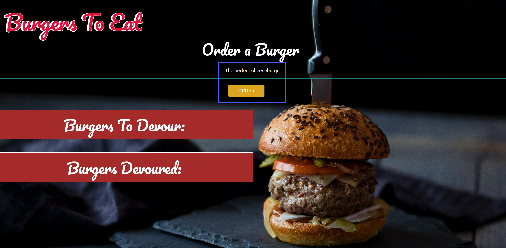
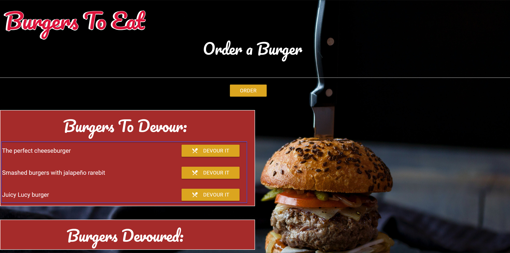
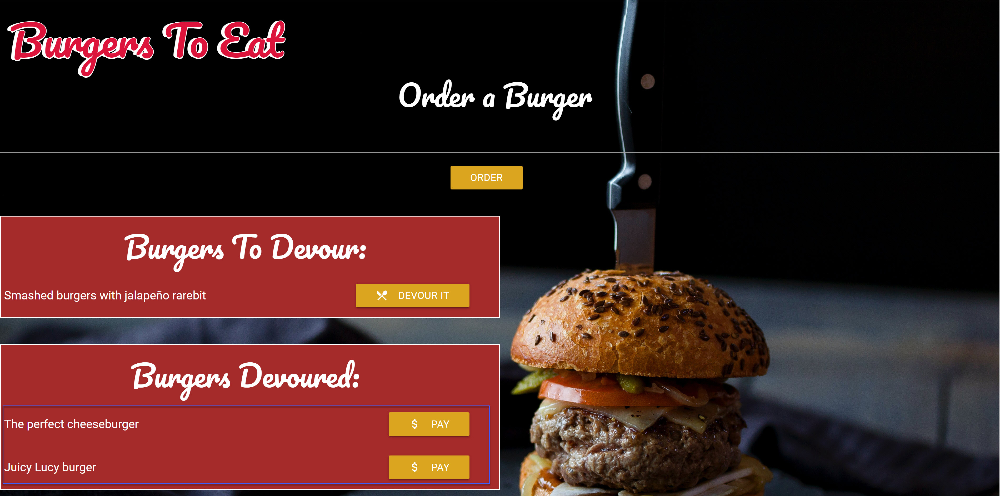
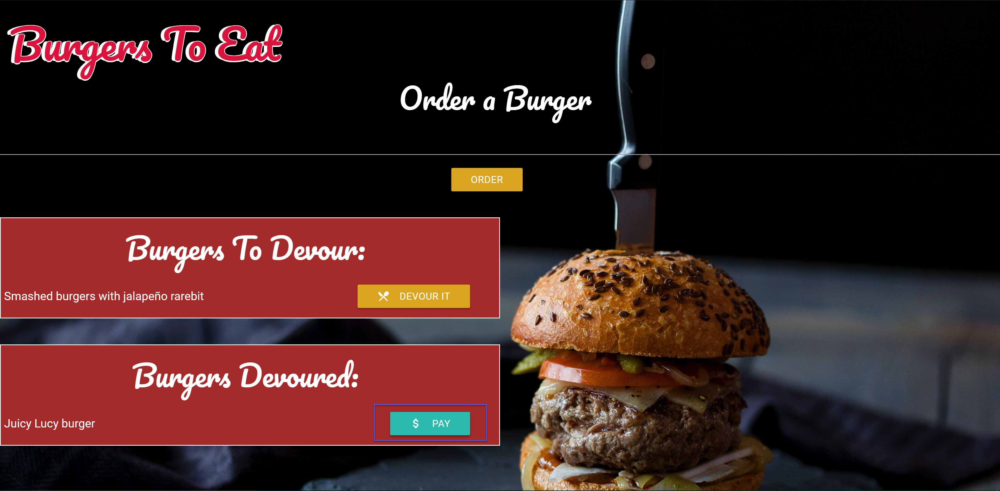

# MBC-Burger-Logger

## Application & Repository Link

###### [Application Link](https://afternoon-coast-51677.herokuapp.com/)

###### [Repository Link](https://github.com/Suji-GitH/MBC-Burger-Logger)

## Content
- [Overview](#Overview)
- [Acceptance Criteria](#Acceptance-Criteria)
- [Application Screens](#Application-Screens)
- [Installation](#Installation)
- [Credits](#Credits)
- [Testing](#Testing)

## Overview

```
Create a burger logger with MySQL, Node, Express, Handlebars and a homemade ORM following the MVC design pattern and use Node and MySQL to query and route data in your app, and Handlebars to generate your HTML.
```

## Acceptance Criteria

* Eat-Da-Burger! is a restaurant app that lets users input the names of burgers they'd like to eat.
* Whenever a user submits a burger's name, your app will display the burger on the left side of the page -- waiting to be devoured.
* Each burger in the waiting area also has a Devour it! button. When the user clicks it, the burger will move to the right side of the page.
* Your app will store every burger in a database, whether devoured or not.

## Installation

1. Download/Clone this GitHub repository.
2. Install dependencies via npm mysql. 
3. Run schema.sql and seed.sql from db file to set up your database.
4. Run the app through node.js by npm start.

## Application-Screens

###### App Screenshots

Landing Page


Add burger


Burgers List


Devoured List


Delete Burger


## Credits

- Heroku
- materialize
- Handlebars
- npm mysql
- npm dotevn
- mySQL Workbench 8.0
- node.js

## Testing

Only positive path scenario have been tested. 

```
Given that user enters a burger they want to devour in the input and clicks "order" the item is added to the burgers to devour table.

Given that user clicks "devour it" button the item is added to the Burgers devoured table.

Given that user clicks "pay" button the item is deleted from the Burgers devoured table.

Check all changes create, update, and delete method reflect on the data base. 

```